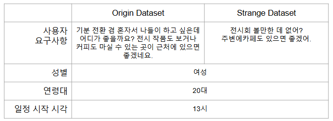

# What should I do TodaY (WITY)

<p>


&nbsp;&nbsp;&nbsp;&nbsp;&nbsp;&nbsp;&nbsp;&nbsp;&nbsp;&nbsp;&nbsp;&nbsp;&nbsp;&nbsp;&nbsp;&nbsp;&nbsp;&nbsp;&nbsp;&nbsp;


</p>


## 📌프로젝트 개요

<p align="center">
  

</p>


>기간 |&nbsp;&nbsp;  25년 1월 10일 ~ 25년 2월 10일

>소개 |<br>
    &nbsp;사람의 기본적인 취향은 바뀌지 않지만 하루하루 상황과 기분은 변화할 수 있습니다.<br> WITY는 그때그때 유저의 변화를 질문 분석을 통해 코스를 생성함으로써 새로운 경험을 전달합니다.

> **참고** |&nbsp;  본 프로젝트는 현재 '서울 종로구'를 한정하여 진행되었습니다. 


<br>
<br>

## 👥 팀원 및 역할

이정휘|강경준|김재겸|권지수|박동혁|이인설
:-:|:-:|:-:|:-:|:-:|:-:
</img>|</img>|</img>|</img>|</img>|</img>|
<a href="https://github.com/LeeJeongHwi" target="_blank"></a>|<a href="https://github.com/K-yng" target="_blank"></a>|<a href="https://github.com/rlaworua5667" target="_blank"></a>|<a href="https://github.com/JK624" target="_blank"></a>|<a href="https://github.com/someDeveloperDH" target="_blank"></a>|<a href="https://github.com/SnowmanLab" target="_blank"></a>
<a href="mailto:wjdgnl97@gmail.com" target="_blank"></a>|<a href="mailto:kangjun205@gmail.com" target="_blank"></a>|<a href="mailto:worua5667@gmail.com" target="_blank"></a>|<a href="mailto:s006249@gmail.com" target="_blank"></a>|<a href="mailto:pangyongpy@gmail.com" target="_blank"></a>|<a href="mailto:luns0712@gmail.com" target="_blank"></a>

<br>

## 팀원 역할

| 이름   | 역할 및 담당 업무 |
|--------|--------------------------------------------------------------|
| **이정휘** | - Jira를 통한 프로젝트 일정 및 태스크 관리 <br> - 구글 맵 리뷰 데이터 수집 <br> - 여러 Map API 비교 및 테스트 <br> - UI 설계 및 Streamlit Map 구현, 전체 baseline 코드 설계 <br> - LLM, Map API를 활용한 카테고리별 장소 선택 기능 구현 |
| **강경준** | - 요약 데이터 parsing 및 VectorDB 구현 <br> - LLM Prompting 기반 경로 생성 능력 테스트 <br> - 리뷰 및 요구사항 기반 Hybrid Search Model 구현 <br> - 경로에 대한 guideline 기반의 카테고리 코스 생성 능력 LLM 평가 |
| **김재겸** | - 리뷰 요약 기능 구현 <br> - 리뷰 요약 능력 평가 및 리뷰 개수에 따른 점수 차이 검증 <br> - 이미지 업로드 기능 구현 |
| **권지수** | - 네이버 지도 리뷰 데이터 수집 <br> - 데이터 전체 검수 및 EDA <br> - 데이터 전처리 |
| **박동혁** | - 카카오 지도 리뷰 데이터 수집 <br> - Streamlit UI 구성 및 구현 <br> - UI와 검색 시스템간 데이터 송수신 처리 |
| **이인설** | - 네이버 지도 리뷰 데이터 수집 <br> - 사용자 요구에 따른 카테고리 경로 생성 구현 <br> - 다양한 조건에 대한 시나리오 데이터 생성 |


<br>
<br>


## 🏛️ 서비스 아키텍처
<p align="center">
  

유저의 요구사항을 반영한 맞춤형 당일 일정 경로 추천을 목표로 하며, 이를 위해 카테고리 기반 경로 생성 후 최적의 장소 추천 방식을 채택하였습니다.

### 🗺️ 카테고리 기반 추천 코스 생성
- "요구사항", "연령대", "성별", "일정 시작 시간"입력을 바탕으로 적절한 카테고리 기반 경로를 생성
  - ex) `[["음식점"], ["카페"], ["체험관광"], ["음식점"]]`
- LLM기반으로 카테고리 생성 후 파싱
  - [category.py](https://github.com/boostcampaitech7/level4-nlp-finalproject-hackathon-nlp-10-lv3/blob/main/baseline/utils/category.py#L40) 코드 참조

### 🎯 반경 내 장소 필터링
- 사용자가 가고자하는 장소를 입력하면, 반경 500m ~ 1km 내 DB에 등록된 장소만 추출
- Naver Search API를 통해 입력된 장소의 위도 경도를 구함
- 입력된 장소와 DB에 있는 장소들과의 위도 경도 기반으로 Haversine 공식을 적용해 직선거리를 구해서 장소들을 필터링함
  - [database.py](https://github.com/boostcampaitech7/level4-nlp-finalproject-hackathon-nlp-10-lv3/blob/main/baseline/db/database.py#L81) query 참조

### 🔍 카테고리별 후보 장소 탐색
- 사용자 요구사항과 반경 내 장소들의 리뷰 간 유사도 기반 검색을 수행하는 RAG 시스템
- Milvus기반 Hybrid Search 수행
- 요약된 긍정, 부정 리뷰와 요구사항간의 유사도 계산 후 두 값의 차를 이용해 Dense Score 계산
$$\text{Dense Score} = \frac{PosCnt}{PosCnt + NegCnt} PosScore - \frac{NegCnt}{PosCnt+NegCnt} NegScore$$
- [Retrieve.py](https://github.com/LeeJeongHwi/WITY/blob/main/baseline/model/Retrieve.py)
### ⭐ 후보 장소 중 추천장소 선정
- Retrieval로 탐색된 장소들 중에서 가장 리뷰와 유사하고 거리가 가까운 장소 선택
- 각 카테고리별로 장소를 탐색할 때, 이전 카테고리에서 선택된 장소와 후보장소들 간의 거리를 구함
  - TMap API를 사용해 후보 장소와 이전에 선택된 장소와의 거리와 소요시간을 구함
- LLM Prompting으로 후보 장소 reranking 수행
  - [recommend.py](https://github.com/LeeJeongHwi/WITY/blob/main/baseline/utils/recommend.py) 참조


## 📆 프로젝트 타임라인

<p align="center">
  

<br>
<br>

## 📂 파일구조

```python
  📦level4-nlp-finalproject-hackathon-nlp-10-lv3
  ┣ 📂baseline
  ┃ ┃ ┗ 📜config.toml
  ┃ ┣ 📂db # RDB, VectorDB 생성 
  ┃ ┃ ┣ 📜database.py # Database 연결 및 select 클래스
  ┃ ┃ ┣ 📜rdb_create_code.py # RDB 생성 코드
  ┃ ┃ ┗ 📜vectordb_test_code.py # Vector DB 생성 코드
  ┃ ┣ 📂mapAPI
  ┃ ┃ ┣ 📜NaverSearchAPI.py # Search API
  ┃ ┃ ┗ 📜TMapAPI.py # TMap API request 코드 및 parsing
  ┃ ┣ 📂model
  ┃ ┃ ┣ 📜ChatModel.py # HyperCLOVA X Chat Model 클래스
  ┃ ┃ ┣ 📜Retrieve.py # Retrieval 모델 클래스
  ┃ ┃ ┗ 📜sparse_embedding.pkl
  ┃ ┣ 📂utils
  ┃ ┃ ┣ 📜category.py # 카테고리 기반 경로 생성
  ┃ ┃ ┣ 📜coll_name_mapping.py 
  ┃ ┃ ┣ 📜geopy_util.py 
  ┃ ┃ ┗ 📜recommend.py # 후보 장소 중 추천 장소 선정
  ┃ ┣ 📜.env
  ┃ ┗ 📜main.py # 전체 실행파일 및 Streamlit UI
```


## ⚙️ How to run

### 0. 데이터 준비, env 설정
-  `[id, domain, name, main_category, category, rating, address, business_hours, price_per_one]` 으로 구성된 "장소 정보 csv 파일" 필요합니다.
- `[id, domain, name, reviews]` 으로 구성된 "장소에 따른 리뷰 csv 파일" 필요합니다.

필요한 API Key는 다음과 같습니다. baseline 폴더 내 `.env` 파일 생성 후 아래 키 설정을 해주세요.
```
NAVER_MAP_API_ID = ""
NAVER_MAP_API_KEY = ""
NAVER_SEARCH_API_ID = ""
NAVER_SEARCH_API_KEY = ""
CLOVA_API_KEY = ""
CLOVA_SERVICE_KEY = ""
TMAP_API_KEY = ""
```

### 1. RDB, VectorDB 생성
```
python baseline/db/rdb_create_code.py #SQLlite DB생성
python baseline/db/vectordb_test_code.py # 벡터 DB 생성
```
- 각 코드 내 경로 수정이 필요합니다.

### 2. UI 실행
```
streamlit run main.py # 스트림릿 UI실행
```

## 📊 평가
* 요약에 대한 평가

<p align="center">
  

>G_eval 평가 방식과 독립표본-t 검정을 참고하여  긍정과 부정 리류 요약 결과에 대한 평가를 진행 하였고 평가 항목은 다음과 같습니다.

| 평가 항목     | 설명                                       | 점수 범위   |
|---------------|--------------------------------------------|------------|
| **Coherence** | 긍정/부정 요약과 전체 요약이 논리적으로 연결되는가? | 1~5점      |
| **Consistency** | 원본 리뷰에 기반한 사실적 일치 여부, 환각 정보 여부 | 1~5점      |
| **Fluency**   | 문법, 맞춤법, 문장 구조 등의 자연스러움       | 1~3점      |
| **Relevance** | 원문의 핵심 내용을 명확히 반영하는가?       | 1~5점      |


> 결과 : 리뷰의 갯수가 많아 질 수록 ,특히 부정적, 요약의 품질이 떨어짐에 최근 달린 리뷰들로 갯수 한정 지어 요약을 진행하였습니다.

<br>

* 경로 생성에 대한 평가

<p align="center">
  

>아래와 같이 시나리오 데이터 셋을 GPT-4o를 통하여 진행하였습니다.
<details>

  <summary>시나리오 데이터</summary>
  <p align="center">
  

</details>
<br>

>결과 :  먼저, Origin의 경우 매우 구체적이고, 디테일한 고객 요구 사항이 주어지는 경우를 상정했습니다. Few-shot과 CoT의 경우 80%에 근접하는 성적을 얻을 수 있었고 다음으로 Strage의 경우, 간결한 요구 사항이 주어지는 경우를 상정했습니다 요구 사항이 많지 않기 때문에 평가할 사항이 많지 않고, orgin과 비교하여 전반적으로 점수가 높은 것을 확인이 됩니다. 추가적으로 두 경우 모두 성능 향상을 위해 Self-Refine을 적용시켰으나, 충분한 향상을 이끌어내지 못하여 추후, Self-Refine을 더욱 고도화 하거나 guide-line을 평가가 아닌 Self-Refine 과정에 포함시켜 더욱 성능을 개선할 수 있을 것으로 기대됩니다.


# 📑 추가 자료

[📄 프로젝트 보고서 (PDF)](report/NLP-10-기업해커톤-wrapupreport.pdf)


