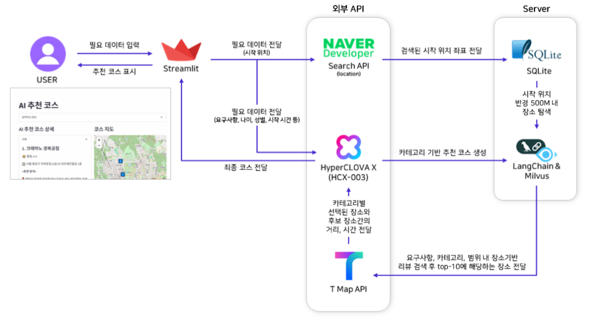
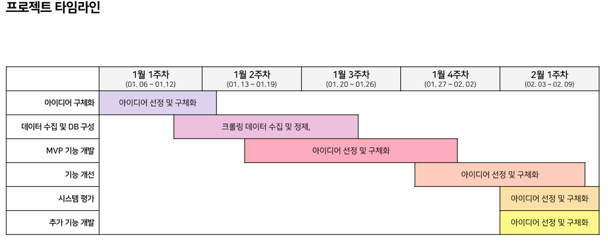
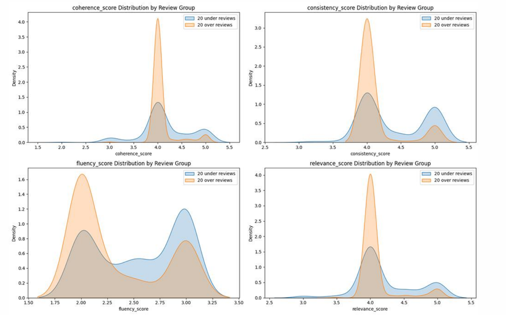
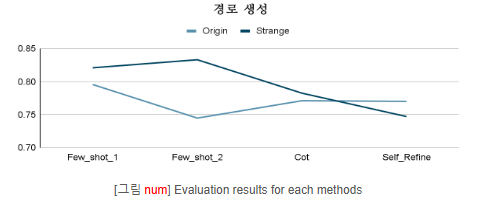

# :compass:WITY (What should I do TodaY)


<p>
  &nbsp;&nbsp;&nbsp;&nbsp;&nbsp;&nbsp;&nbsp;&nbsp;&nbsp;&nbsp;&nbsp;&nbsp;
</p>


## 📌프로젝트 개요

<p align="center">
  

</p>


>기간 |&nbsp;&nbsp;  25년 1월 10일 ~ 25년 2월 10일

>소개 |<br>
    &nbsp;사람의 기본적인 취향은 바뀌지 않지만 하루하루 상황과 기분은 변화할 수 있습니다.<br> 우리의 서비스는 그때그때 유저의 변화를 질문 분석을 통해 코스를 생성함으로써 새로운 경험을 전달합니다.

> **참고** |&nbsp;  본 프로젝트는 현재 '서울 종로구'를 한정하여 진행되었습니다. 


<br>
<br>

## 👥 팀원 및 역할
### 팀원

이정휘|강경준|김재겸|권지수|박동혁|이인설
:-:|:-:|:-:|:-:|:-:|:-:
</img>|</img>|</img>|</img>|</img>|</img>|
<a href="https://github.com/LeeJeongHwi" target="_blank"></a>|<a href="https://github.com/K-yng" target="_blank"></a>|<a href="https://github.com/rlaworua5667" target="_blank"></a>|<a href="https://github.com/JK624" target="_blank"></a>|<a href="https://github.com/someDeveloperDH" target="_blank"></a>|<a href="https://github.com/SnowmanLab" target="_blank"></a>
<a href="mailto:wjdgnl97@gmail.com" target="_blank"></a>|<a href="mailto:kangjun205@gmail.com" target="_blank"></a>|<a href="mailto:worua5667@gmail.com" target="_blank"></a>|<a href="mailto:s006249@gmail.com" target="_blank"></a>|<a href="mailto:pangyongpy@gmail.com" target="_blank"></a>|<a href="mailto:luns0712@gmail.com" target="_blank"></a>

<br>

### 역할

| 이름   | 역할 및 담당 업무 |
|--------|--------------------------------------------------------------|
| **이정휘** | - Jira를 통한 프로젝트 일정 및 태스크 관리 <br> - 구글 맵 리뷰 데이터 수집 <br> - 여러 Map API 비교 및 테스트 <br> - UI 설계 및 Streamlit Map 구현, 전체 baseline 코드 설계 <br> - LLM, Map API를 활용한 카테고리별 장소 선택 기능 구현 |
| **강경준** | - 요약 데이터 parsing 및 VectorDB 구현 <br> - LLM Prompting 기반 경로 생성 능력 테스트 <br> - 리뷰 및 요구사항 기반 Hybrid Search Model 구현 <br> - 경로에 대한 guideline 기반의 카테고리 코스 생성 능력 LLM 평가 |
| **김재겸** | - 리뷰 요약 기능 구현 <br> - 리뷰 요약 능력 평가 및 리뷰 개수에 따른 점수 차이 검증 <br> - 이미지 업로드 기능 구현 |
| **권지수** | - 네이버 지도 리뷰 데이터 수집 <br> - 데이터 전체 검수 및 EDA <br> - 데이터 전처리 |
| **박동혁** | - 카카오 지도 리뷰 데이터 수집 <br> - Streamlit UI 구성 및 구현 <br> - UI와 검색 시스템간 데이터 송수신 처리 |
| **이인설** | - 네이버 지도 리뷰 데이터 수집 <br> - 사용자 요구에 따른 카테고리 경로 생성 구현 <br> - 다양한 조건에 대한 시나리오 데이터 생성 |


<br>
<br>

## :gear:아키텍처
<p align="center">
  

>진행방법 | <br>  1) &nbsp;3사에 대한 장소정보와 리뷰 크롤링 후 전처리
<br>  2) &nbsp;각 가게에 대한 리뷰를 요약
<br>  3) &nbsp; 장소 정보 DB와 리뷰 벡터 DB 생성
<br>  4) &nbsp; 사용자로 부터 질문, 나이, 장소, 시작시간, 성별 정보를 받기
<br>  5) &nbsp;  코스 생성
<br>   &nbsp; &nbsp; 5-1) &nbsp; CoT기반의 프롬프트 엔지니어링을 하여 하이퍼 클로버 X로 카테고리 코스 생성
<br>   &nbsp; &nbsp; 5-2) &nbsp; 사용자 질문에 적학한 장소를 리트리버를 통하여 찾기
<br>   &nbsp; &nbsp; 5-3) &nbsp; 사용자에게 입력받은 장소의 위도 경도를 기준으로 리트리버에서 뽑힌 장소들의 거리를 고려하여 코스 생성
<br>  6) &nbsp;  사용자에게 생성된 코스 정보 시각화
<br>
<br>

## 📆프로젝트 진행 계획

<p align="center">
  


<br>
<br>

## 📂파일구조

```
  📦level4-nlp-finalproject-hackathon-nlp-10-lv3
  ┣ 📂EDA
  ┃ ┣ 📂concat
  ┃ ┃ ┣ 📜cleaning_business_hours_1.ipynb
  ┃ ┃ ┣ 📜cleaning_business_hours_2.ipynb
  ┃ ┃ ┣ 📜eda_all_1.ipynb
  ┃ ┃ ┣ 📜eda_all_2.ipynb
  ┃ ┃ ┗ 📜eda_all_3.ipynb
  ┃ ┣ 📂crawling
  ┃ ┃ ┣ 📜eda_google_1.ipynb
  ┃ ┃ ┣ 📜eda_kakao_1.ipynb
  ┃ ┃ ┣ 📜eda_naver_1-1.ipynb
  ┃ ┃ ┗ 📜eda_naver_1-2.ipynb
  ┃ ┗ 📂figure
  ┃ ┃ ┗ 📜EDA.ipynb
  ┣ 📂baseline
  ┃ ┃ ┗ 📜config.toml
  ┃ ┣ 📂db
  ┃ ┃ ┣ 📜course_rcmd.db
  ┃ ┃ ┣ 📜course_rcmd_pos.db
  ┃ ┃ ┣ 📜database.py
  ┃ ┃ ┣ 📜db_test_code.py
  ┃ ┃ ┣ 📜place_Information.db
  ┃ ┃ ┗ 📜vectordb_test_code.py
  ┃ ┣ 📂mapAPI
  ┃ ┃ ┣ 📜NaverSearchAPI.py
  ┃ ┃ ┗ 📜TMapAPI.py
  ┃ ┣ 📂model
  ┃ ┃ ┣ 📜ChatModel.py
  ┃ ┃ ┣ 📜Retrieve.py
  ┃ ┃ ┗ 📜sparse_embedding.pkl
  ┃ ┣ 📂utils
  ┃ ┃ ┣ 📜category.py
  ┃ ┃ ┣ 📜coll_name_mapping.py
  ┃ ┃ ┣ 📜geopy_util.py
  ┃ ┃ ┗ 📜recommend.py
  ┃ ┣ 📜.env
  ┃ ┗ 📜main.py #실행파일
  ┣ 📂evaluation
  ┃ ┣ 📜configs.yaml
  ┃ ┣ 📜evaluation.py
  ┃ ┣ 📜make_category_route.py
  ┃ ┣ 📜make_scenario.py
  ┃ ┗ 📜summary_evaluation.py
  ┣ 📂model
  ┃ ┗ 📜sparse_embedding.pkl
  ┣ 📂prompts
  ┃ ┣ 📜cate_crs_eval_prmpt.yaml
  ┃ ┣ 📜eval_summary_prompt.txt
  ┃ ┣ 📜prompt_summary.txt
  ┃ ┣ 📜query_prompt.txt
  ┃ ┗ 📜system_prompt.txt
  ┣ 📂temps
  ┃ ┗ 📜imagetomood.py
  ┣ 📂utils
  ┃ ┣ 📜__init__.py
  ┃ ┗ 📜util.py
  ┣ 📜construct_vectorDB.py
  ┣ 📜requirements.txt
  ┗ 📜review_summary.py
```


## ▶️How to run

```
#사전 준비

python baseline/db/db_test_code.py #SQLlite DB생성
python baseline/db/vectordb_test_code.py # 벡터 DB 생성
```

```
#서비스 코드 실행

cd baseline
streamlit run main.py # 스트림릿 UI실행
```


<br>
<br>

## 평가
### 리뷰 요약 모델 평가

| 평가 항목     | 설명                                       | 점수 범위   |
|---------------|--------------------------------------------|------------|
| **Coherence** | 긍정/부정 요약과 전체 요약이 논리적으로 연결되는가? | 1~5점      |
| **Consistency** | 원본 리뷰에 기반한 사실적 일치 여부, 환각 정보 여부 | 1~5점      |
| **Fluency**   | 문법, 맞춤법, 문장 구조 등의 자연스러움       | 1~3점      |
| **Relevance** | 원문의 핵심 내용을 명확히 반영하는가?       | 1~5점      |

- 평가 방법
  - **Hyper Clova X(HCX-003)** 활용한 LLM 기반 평가
  - **LLM prompting** 기반으로 상기의 평가 항목에 대한 평가 진행
  - 리뷰 개수에 따른 요약 성능 차이 분석을 위해, 리뷰 개수 **20개를 기준으로 두 그룹으로 구분**
  - 각 그룹 별로 데이터 300개 샘플링하여 평가 진행
  - 평가 신뢰도를 높이고 continuous한 score를 얻기 위해, **20회 반복 평가 수행**

<p align="center">
  

- 평가 결과
  - 리뷰 개수 20개 이하인 데이터에서 대체로 높은 성적을 보였고,  
    특히 일관성(Coherence)과 관련성(Relevance) 지표에서 차이가 두드러짐
  - 두 그룹에 대한 독립 표본 t-test 수행 결과,  
    coherence, relevance, consistency 세 항목에서 유의수준 0.05 기준으로 유의미한 차이를 확인
 
- 결론
  - **리뷰 개수가 많을수록 요약 성능이 떨어지는 경향성** 존재
  - 부정적 의견을 요약할 때, 내용이 일부 누락되는 문제 발생
  - 따라서, 적절한 리뷰 개수를 설정하여 요약하는 것이 품질 향상에 도움이 될 것으로 보임
  - 추후에는 적절한 리뷰 개수 설정 방안 및 설정 기준 등에 대한 연구가 필요할 것으로 사료됨

<br>

### 경로 생성 모델 평가

- 시나리오 데이터 생성
  - 실제 사용자 활용성에 대한 평가를 위해, 사용자 요구사항 데이터 생성
  - '성별', '연령대', '일정 시작 시간'을 랜덤하게 생성한 뒤, **'사용자 요구 사항'을 LLM을 통해 생성**
  - '사용자 요구 사항'이 구체적이고 자세한 original dataset과 일부 내용이 생략되거나 글이 간결하게 작성된 strange dataset **두 가지 경우 상정**
 
- 평가 방법
  - **생성하지 말아야 할 경로들의 특성**을 기준으로 평가 guide-line 작성
  - 해당 guide-line을 기준으로 LLM 평가 진행 / **gpt-4o** 활용
  - 경로를 생성하는 **4가지 methods(few-shot(v1), few-shot(v2), CoT, Self-Refine)에** 대해 각각 평가 진행
  - 각 methods별로 전체 데이터 중 guide-line을 모두 만족하는 데이터의 비율 비교
      
      $$Score=\dfrac{\text{number of data points meeting guide-lines}}{\text{number of total data points}}$$

<p align="center">
  

- 결과
  - 전반적으로 만족해야 할 조건이 만은 **origin dataset이 strange dataset에서 보다 낮은 성적**을 보여줌
  - Few-shot에서 높은 성적을 보이고 있고, **CoT와 Self-Refine에서는 상대적으로 낮은 성적**을 보임
  - 이러한 문제는 **CoT와 Self-Refine 내부에서 guide-line을 직접적으로 활용**함으로써 성능을 개선할 수 있을 것으로 보임


<br>
<br>


# 추가 자료

[📄 프로젝트 보고서 (PDF)](report/NLP-10-기업해커톤-wrapupreport.pdf)


