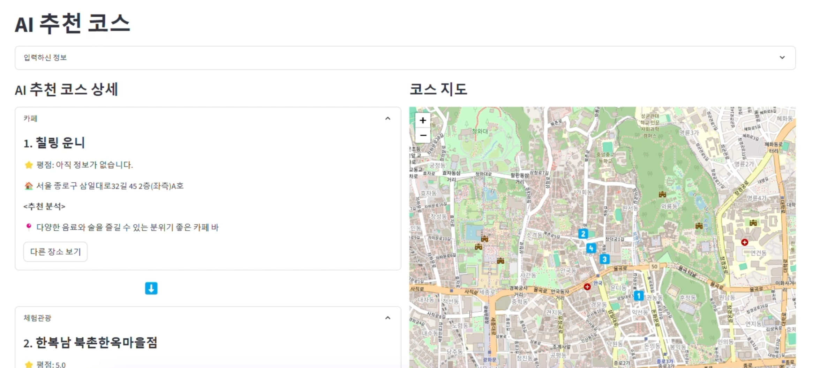

# 개인화 코스 추천 시스템

&nbsp;&nbsp;&nbsp;&nbsp;&nbsp;&nbsp;&nbsp;&nbsp;&nbsp;&nbsp;&nbsp;&nbsp;&nbsp;&nbsp;&nbsp;&nbsp;&nbsp;&nbsp;&nbsp;&nbsp;

## 목차

  
- [프로젝트 개요](#프로젝트-개요)
- [팀원 및 개인 역할](#팀원-및-역할)
- [아키텍처](#아키텍처)
- [API 명세서](#API-명세서)
- [Commit Ruel](#Commit_Rule)
  

 
 

## 📌프로젝트 개요

  

>기간 |&nbsp;&nbsp;  25년 1월 10일 ~ 25년 2월 10일

>소개 | 
    &nbsp;사람의 기본적인 취향은 바뀌지 않지만 하루하루 상황과 기분은 변화할 수 있습니다.  우리의 서비스는 그때 그떄의 유저의 변화를 질문 분석을 통하여 코스를 생성함으로서 새로운 경험을 전달합니다.

> **참고** |&nbsp;  본 프로젝트는 현재 '서울 종로구'를 한정하여 진행되었습니다. 

 
 

## 👥 팀원 및 역할

이정휘|강경준|김재겸|권지수|박동혁|이인설
:-:|:-:|:-:|:-:|:-:|:-:
</img>|</img>|</img>|</img>|</img>|</img>|
|||||
|||||

 
 

## 아키텍처

 
 

## API 명세서 

 
 

## Commit Rule
 

| **유형**  | **설명** |
|----------------|----------------------------------------|
| **feat**       | 기능 (새로운 기능)                     |
| **fix**        | 버그 (버그 수정)                       |
| **refactor**   |리팩토링                                |
| **style**      | 스타일 (코드 형식, 세미콜론 추가: 비즈니스 로직에 변경 없음) |
| **docs**       | 문서 (문서 추가, 수정, 삭제)           |
| **test**       | 테스트 (테스트 코드 추가, 수정, 삭제: 비즈니스 로직에 변경 없음) |
| **chore**      | 기타 변경사항 (빌드 스크립트 수정 등)  |

